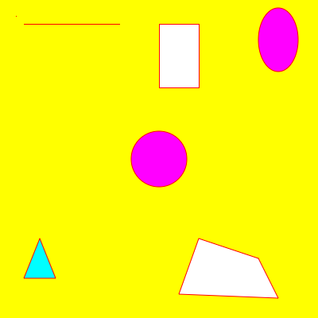

## Colors

### Color Names
The simplest way to refer to colors when using p5.js is to use pre-defined colors names. For example: "Red", "Yellow", "Purple", ...

To see a list of available color names, see <a href="https://www.w3schools.com/colors/colors_names.asp" target="_blank">https://www.w3schools.com/colors/colors_names.asp</a> 

### Background
> TODO - changing the background color

### Stroke (line) color
> TODO - stroke color

### Filling shapes
> TODO - fill color

> TODO - note that the color STAYS changed for all future strokes/shapes

## References
https://p5js.org/learn/color.html


## Example

```
    // Create a blank canvas 600 pixels high and 600 pixels wide
    createCanvas(400, 400);

    // Set the background to yellow
    background("Yellow");
    
    // Set the line color (for all points, lines, and shape 
    // outlines) to red
    stroke("Red");
    
    // Top left - a point and a line
    point(20, 20);
    
    line(30, 30, 150, 30);
    
    // Top center - rectangle
    // Draws with a default fill color of white
    rect(200, 30, 50, 80);
    
    // Top right - ellipse
    // Change the fill color to purple
    fill("Purple");
    ellipse(350, 50, 50, 80);
    
    // Center - circle via an ellipse with the same w and h
    // Fill color stays purple
    ellipse(200,200,70,70);
    
    // Bottom left - triangle
    // Change fill color to aqua
    fill("Aqua");
    triangle(50, 300, 30, 350, 70, 350);
    
    // Bottom right - quad
    // Change fill color back to white
    fill(255,255,255);
    quad(250, 300, 325, 325, 350, 375, 225, 370);
 ```

