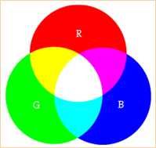

## Colors

### RGB values
Any color can be defined as a combination of the colors **R**ed, **G**reen, and **B**lue. We refer to these as 3 "channels".

Each RGB channel is defined via a number between 0 (none) and 255 (max value for that channel). For example, to get a bright blue, we'd use: r = 0, g = 0, b = 255.

To get grayscale values we use the same value for all 3 channels. For example, black (no color) is r, g, and b all equal to 0. White is all channels set to 255.

When defining colors in p5.js, we'll provide all the values in order (rgb) separated by commas.

|Color|Red|Green|Blue|Combined|
|-----|---|-----|----|--------|
|Red|255|0|0|(255,0,0)|
|Green|0|255|0|(0,255,0)|
|Blue|0|0|255|(0,0,255)|
> TODO - list of common colors and rgb values

### Background
> TODO - changing the background color

### Stroke (line) color
> TODO - stroke color

### Filling shapes
> TODO - fill color

> TODO - note that the color STAYS changed for all future strokes/shapes
