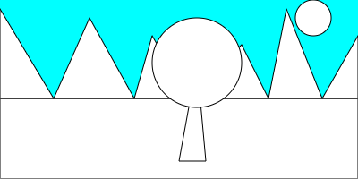

*Note that the examples in this section were made by first doing a **lot** of planning on paper. You can see the steps I went through to determine the shapes needed, drawing order, coordinates, etc. in: [ScenePlanning.pdf](ScenePlanning.pdf).*

## Shape drawing order
In order to have our shapes display correctly, the **order** in which we draw them matters!

For example, consider the scene below:


We need to draw the sun *first* because it should always be at the "back" of the scene. Then the ground. Then the mountains.

The code for this is:
```
function setup() {
  // I need a 400x200 canvas
  createCanvas(400, 200);
}

function draw() {
  // Set the overall background color
  background(220);
    
  // Sun
  ellipse(350, 20, 40, 40);
  
  // Grass
  rect(0, 110, 400, 90);
  
  // Mountains
  triangle(0, 10, 0, 110, 60, 110);
  triangle(60,110, 100, 20, 150,110);
  triangle(150, 110, 170, 40, 210, 110);
  triangle(210, 110, 270, 50, 300, 110);
  triangle(300, 110, 320, 10, 360, 110);
  triangle(360, 110, 400, 40, 400, 110);
}
```

If we want to add a tree to the front of the picture, that code gets added *after* the set of triangles used to draw the mountains.

```
function draw() {
  // Set the overall background color
  background(220);
    
  // Sun
  ellipse(350, 20, 40, 40);
  
  // Grass
  rect(0, 110, 400, 90);
  
  // Mountains
  triangle(0, 10, 0, 110, 60, 110);
  triangle(60,110, 100, 20, 150,110);
  triangle(150, 110, 170, 40, 210, 110);
  triangle(210, 110, 270, 50, 300, 110);
  triangle(300, 110, 320, 10, 360, 110);
  triangle(360, 110, 400, 40, 400, 110);
}
```

The results in the tree being drawn "on top" of the rest of the scene:


The concept of "order" in our code will be important when we add colors as well. Each time we define a color to be used, that color is used for everything drawn (until the color changes again).

## Color Names
The simplest way to refer to colors when using p5.js is to use pre-defined colors names. For example: "Red", "Yellow", "Purple", ...

To see a list of available color names, see <a href="https://www.w3schools.com/colors/colors_names.asp" target="_blank">https://www.w3schools.com/colors/colors_names.asp</a> 

## Background
To change the background color of the canvas, we use the command `background` with a color name:
```
background("Aqua");
```

Adding this to our scene results in:




## Filling shapes
In order to fill the various shapes in the scene with color, we use the command `fill` with a color name. **However**, once we set a fill color **ALL** shapes will become that color. For example, if we set the fill to `"DarkOrange"` before drawing the sun using:

```
  // Sun
  fill("DarkOrange");
  ellipse(350, 20, 40, 40);
```

we get:


In order to have each shape be its own color, we need to keep changing the fill. The final code to produce a colored scene is:

```
function setup() {
  // I need a 400x200 canvas
  createCanvas(400, 200);
}

function draw() {
  // Set the overall background color
  background("Aqua");
    
  // Sun
  fill("DarkOrange");
  ellipse(350, 20, 40, 40);
  
  // Grass
  fill("Green");
  rect(0, 110, 400, 90);
  
  // Mountains
  fill("DarkGrey");
  triangle(0, 10, 0, 110, 60, 110);
  triangle(60,110, 100, 20, 150,110);
  triangle(150, 110, 170, 40, 210, 110);
  triangle(210, 110, 270, 50, 300, 110);
  triangle(300, 110, 320, 10, 360, 110);
  triangle(360, 110, 400, 40, 400, 110);
    
  // Tree trunk
  fill("Sienna");
  triangle(220, 70, 200, 180, 230, 180);
  
  // Tree top
  fill("LightGreen");
  ellipse(220, 70, 100, 100);
  
}
```


## Stroke (line) color

The colored scene above looks pretty good, but the black outlines on each shape are distracting.

To make them go away, we can add `noStroke();` right after setting the background color.

```
  // Set the overall background color
  background("Aqua");
  
  // Remove all shape outlines
  noStroke();
    
```


To change the outline color and weight (i.e. to make the sun look more interesting), we can use the commands `stroke` to set the color and `strokeWeight` to set the width of the line (in pixels).

```
  // Sun (with a gold border)
  stroke("DarkOrange");
  strokeWeight(5);
  fill("Gold");
  ellipse(350, 20, 40, 40);
  
  // Remove all future shape outlines
  noStroke();
    
```


## References
https://www.w3schools.com/colors/colors_names.asp
https://p5js.org/learn/color.html
https://p5js.org/reference/#/p5/background
https://p5js.org/reference/#/p5/fill
https://p5js.org/reference/#/p5/noStroke
https://p5js.org/reference/#/p5/stroke
https://p5js.org/reference/#/p5/strokeWeight

## Another Example
The code below adds colors to the shape example from last time. Run it and see what you get!

```
    // Create a blank canvas 600 pixels high and 600 pixels wide
    createCanvas(400, 400);

    // Set the background to yellow
    background("Yellow");
    
    // Set the line color (for all points, lines, and shape 
    // outlines) to red
    stroke("Red");
    
    // Top left - a point and a line
    point(20, 20);
    
    line(30, 30, 150, 30);
    
    // Top center - rectangle
    // Draws with a default fill color of white
    rect(200, 30, 50, 80);
    
    // Top right - ellipse
    // Change the fill color to purple
    fill("Purple");
    ellipse(350, 50, 50, 80);
    
    // Center - circle via an ellipse with the same w and h
    // Fill color stays purple
    ellipse(200,200,70,70);
    
    // Bottom left - triangle
    // Change fill color to aqua
    fill("Aqua");
    triangle(50, 300, 30, 350, 70, 350);
    
    // Bottom right - quad
    // Change fill color back to white
    fill(255,255,255);
    quad(250, 300, 325, 325, 350, 375, 225, 370);
 ```

[Click here for the color example result](colors.png)