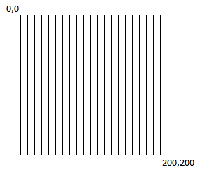
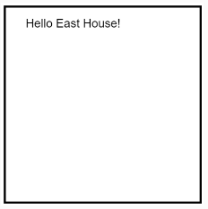
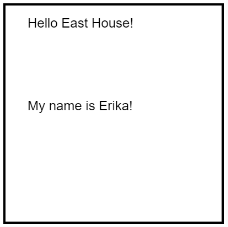

## Drawing with a computer

### Program structure
**Functions** are sections of program code that the computer runs together. By default, every p5.js program has two main "functions": `setup` and `draw`.

Everything with the starting `{` and ending `}` of the function will be run, in the order that it is written, by the computer. Any lines beginning with `\\` are ignored by the computer. These are **comment** lines and we use them to add our own notes to the program.


```
// setup : Initialization runs once; called automatically
function setup() {
    
}

// draw : Loops forever; called automatically
function draw() {

}

 ```
 
 To make the program actually do something, we'll be adding **command statements** within the functions. *(To start, we'll be adding commands only within `setup`.)*

### Adding commands
Everything we draw using p5.js is placed onto a **canvas**. 

We create the canvas and specify its size, in pixels, using the `createCanvas` command. We use the `background` command to set the canvas background color (more on colors later - for now, know that `255` is white).

For example, the following statements, placed inside `setup()`, create a blank canvas 200 pixels high and 200 pixels wide with a white background.

```
createCanvas(200, 200);
background(255);
```

In order to draw something onto the canvas, we need to know:
- what we want to draw
- where we want to draw it

*What* is typically a shape of some sort (text, circles, lines, etc.).

*Where* is a **coordinate** on the canvas. We define these coordinates as a pair of offsets from the top left corner of the canvas: (x,y).
- **x**: The number of pixels right from the left side of the canvas.
- **y**: The number of pixels down from the top side of the canvas.

For example, in the 200x200 canvas defined above, the top left would be at x=0, y=0. The bottom right would be at x=200, y=200. We can represent this using a coordinate grid *(this is why your notebooks have graph paper)*.



We provide the coordinate where we want to *start* drawing to draw something at a specific location on the canvas.

To draw the text "Hello East House!" in the top left corner of the canvas (with a small offset right and down), we add the statement:

```
text("Hello East House!", 25, 25);
```



### Command structure
The `createCanvas`, `background`, and `text` commands used above are examples of **function calls**. In other words, we are telling the computer to run other functions (like setup, but written by someone else) using information we provide.

In the case of `text`, we're providing 3 pieces of information:
- The text to draw: `"Hello East House!"`
- The x offset: `25`
- The y offset: `25`

These three pieces of information are called **parameters**. The actual information passed in for each is called **data**.

Given the *function name* and required *parameters* for the function, we can figure out how to write the command using our own *data*.

| Function Name | Parameters (in required order) | Example |
|----------|----------------------------------|-----------------|----|
| text | (`"`text to draw`"`, x offset, y offset) | `text("Hello East House!", 25, 25);` |

To change the text that is drawn, change the *data* passed into the 1st parameter between the quotation marks:

```
text("My name is Erika!", 25, 25);
```

The change the location of the text to be still on the left side, but halfway down the canvas, we change the data passed into the 3rd parameter from `25` to `100`:
```
text("My name is Erika!", 25, 100);
```



** *A summary of all of the commands we'll use in this class can be found on the [Quick Reference](QuickReference.md) page.* **
