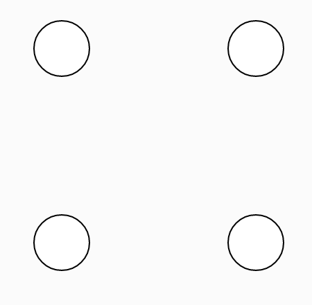
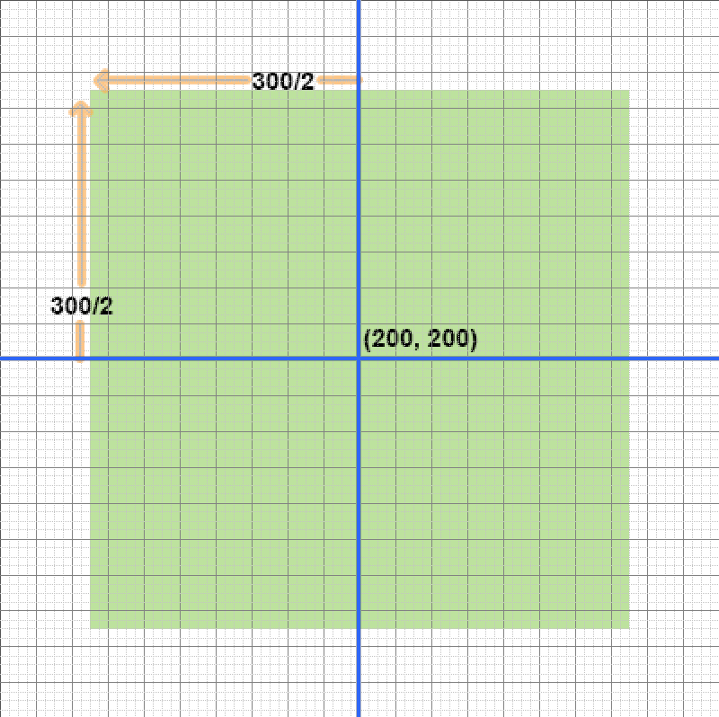

## Math Expressions
Instead of doing math calculations in our heads, we can have JavaScript do the math for us. Anywhere we need a number, we could substitute a **math expression** instead.

### Math Operators
- plus:  `50 + 120`
- minus:  `120 - 50` 
- multiply:  `105 * 2`
- divide:  `400 / 2`

### Parentheses in Math Expressions
You can use parentheses to organize more complicated expressions, for example:
```javascript
(400 / 3) - 20
```
Operations inside parentheses are computed first.

### Example 1
Draw a circle centered at (80, 100):
```javascript
    // Circle at x = 80, y = 100, width & height = 40:
    ellipse(80, 100, 40, 40);
```
...and now draw an identical circle whose center is 140 pixels to the right of 80. The x-coordinate of the new circle needs to be increased by 140.

Calculation options:
1. Calculate `80 + 140` in my head, then type in the answer as the new x-coordinate in my code.
```javascript
    // Identical circle at x = 80 + 140:
    ellipse(220, 100, 40, 40);
```
2. Open a new web browser tab, go to Google to search-calculate `80 + 140`, then type in the answer as the new x-coordinate in my code.

3. Type in the **math expression `80 + 140`** as the new x-coordinate in my code.
```javascript
    // Identical circle at x = 80 + 140:
    ellipse(80 + 140, 100, 40, 40);
```

### Practice 1:
We have two circles, can you draw two more circles that are positioned exactly 140 pixels below the first ones using math expressions for their y-coordinates?




### Example 2
Draw a square whose top-left corner is at (0, 0):
```javascript
// 300x300 square:
rect(0, 0, 300, 300);
```
Draw a square centered at the middle of the 400x400 canvas.
If the canvas is 400 wide and 400 high, the middle of it is (200, 200). Use a math expression to calculate the proper top-left corner position of the square given that it is 300 wide.



```javascript
// 300x300 square centered at (200, 200):
// x coordinate: 200 - 300/2
// y coordinate: 200 - 300/2
rect(200 - (300 / 2), 200 - (300 / 2), 300, 300);
```
### Practice 2:
Can you draw another centered square - one that is 1/3 the size of the first - using math expressions?


&nbsp;
### Next topic: <a href="./Variables.md">Variables</a>

## References
- JavaScript arithmetic: <a href="https://www.w3schools.com/js/js_arithmetic.asp" target="_blank">https://www.w3schools.com/js/js_arithmetic.asp</a>
- p5.js **ellipse** command: <a href="https://p5js.org/reference/#/p5/ellipse" target="_blank">https://p5js.org/reference/#/p5/ellipse</a>
- p5.js **rect** command: <a href="https://p5js.org/reference/#/p5/rect" target="_blank">https://p5js.org/reference/#/p5/rect</a>

