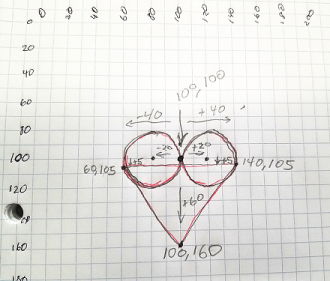

## Drawing a heart

### Planning
Circle widths of 60 & a triangle height of 60.



### Detailed coordinates


### Code
```javascript
function setup() {
  createCanvas(200, 200);
}

function draw() {
  background("White");
  fill("Purple");
  stroke("Purple"); // make the outer lines match the fill

  // 2 scoops of ice cream
  ellipse(80, 100, 40);
  ellipse(120, 100, 40);

  // cone to hold them
  triangle(60, 105,
           140, 105, 
           100, 160);
}
```