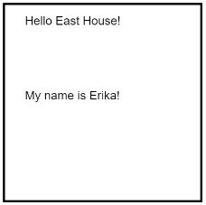

# EVERY software developer starts with a "Hello World" project!

## Create a new sketch

Use `File -> New` to create a new default program.


*The editor will give it some kind of silly default name (e.g., "Fossil accelerator"). You can change the name to whatever you want.*

## Copy/paste in this demo code
```javascript
// SETUP: Called automatically ONCE 
//        at the start of the program
//
// * We don't draw things from inside these { }'s
function setup() {
  createCanvas(200, 200);
}

// DRAW : Called automatically repeatedly to keep
//        drawing whatever we define within { }
function draw() {
  background(220); // 220 is a # value for a gray background
  text("Hello East House!", 25, 25);

  // New text and a y coordinate further down on the canvas
  text("My name is Erika!", 25, 100); 
}
```

## Running the program
Press the play button to run the program. The default sketch will draw a single gray square.


## What's going on?

### Program structure
**Functions** are sections of program code that the computer runs together. By default, every p5.js program has two main "functions": `setup` and `draw`.
- Everything with the starting `{` and ending `}` of the function will be run, in the order that it is written, by the computer when that function is called.
- Any lines beginning with `//` are ignored by the computer. These are **comment** lines and we use them to add our own notes to the program.


```javascript
// SETUP: Called automatically ONCE 
//        at the start of the program
//
// * We don't draw things from inside these { }'s
function setup() {
  createCanvas(200, 200);
}

// DRAW : Called automatically repeatedly to keep
//        drawing whatever we define within { }
function draw() {
  background(220); // 220 is a # value for a gray background
}

 ```
 
To make the program actually do something, we call **command statements** within the functions. The default program has two of these already:
1. `createCanvas` to specify the size of the drawing
2. `background` to reset the background color every time the picture is drawn
 
### Drawing
Everything we draw using p5.js is placed onto a **canvas**. In order to draw something onto the canvas, we need to know:
- what we want to draw
- where we want to draw it

*What* is typically a shape of some sort (text, circles, lines, etc.).

*Where* is a **coordinate** on the canvas. We define these coordinates as a pair of offsets from the top left corner of the canvas: (x,y).
- **x**: The number of pixels right from the left side of the canvas.
- **y**: The number of pixels down from the top side of the canvas.

For example, in the 200x200 canvas defined above, the top left would be at x=0, y=0. The bottom right would be at x=200, y=200. We can represent this using a coordinate grid *(this is why your notebooks have graph paper)*.


We provide the coordinate where we want to *start* drawing to draw something at a specific location on the canvas.

To draw the text "Hello East House!" in the top left corner of the canvas (with a small offset right and down), we add a statement draw the text at the coordinates x=25, y=25.

```javascript
function draw() {
    background(220); // 220 is a # value for a gray background
    text("Hello East House!", 25, 25);
}
```


The `createCanvas`, `background`, and `text` commands used above are examples of **function calls**. In other words, we are telling the computer to run other functions (like setup, but written by someone else) using information we provide.

In the case of `text`, we're providing 3 pieces of information:
- The text to draw: `"Hello East House!"`
- The x offset: `25`
- The y offset: `25`

These three pieces of information are called **parameters**. The actual information passed in for each is called **data**.

The same command, called with different data for each parameter has different results.
```javascript
// New text and a y coordinate further down on the canvas
text("My name is Erika!", 25, 100); 
```

