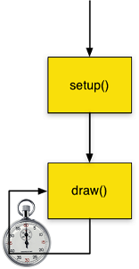
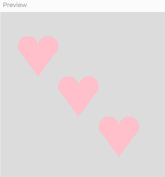
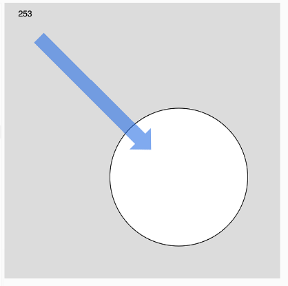
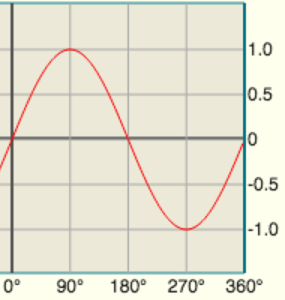
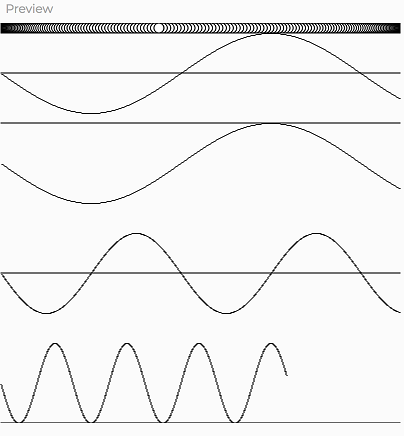

## Functions, Frames, and Animation
### Functions and Frames
**JavaScript function**: Uses the `function` keyword to define a named block of code contained within curly braces ("{" and "}"). When a function is "called," the code within the curly braces executes.
```javascript
	function functionName() {
		statement;
		statement;
	}
```

The p5.js library is structured to check if your program has defined a `setup()` function and a `draw()` function:



- If function `setup()` exists, p5 will call it first.
- If function `draw()` exists, p5 will call it after setup() periodically (default is 60 times per second) for as long as the program runs. If not, execution ends.

**Frame**: The canvas image at a given moment in time.

Each time draw() is called, it can update the canvas. The animation term "frame rate" refers to how many frames - canvas images - are updated over the course of a second. The default frame rate using p5.js is 60 frames per second (HD speed). Disney classic film animation was drawn at 24 fps. Old Hanna-Barbera TV cartoons needed to be drawn at 12 fps (sometimes as low as 8 fps) to keep costs low.

You can change your program's frame rate - how many times per second the draw() function is called - with the **frameRate()** function.
```javascript
	function setup() {
		createCanvas(600, 400);
		// Slow this program down:
		// frameRate(desired_frames_per_sec);
		frameRate(15);
	}
```

### Challenge: What is the difference in behavior?

Program A | Program B
--------- | ---------
function setup() { | function setup() {
&nbsp;&nbsp;&nbsp; createCanvas(200, 200); | &nbsp;&nbsp;&nbsp; createCanvas(200, 200);
} | &nbsp;&nbsp;&nbsp; background("white");
&nbsp; | }
function draw() { | 
&nbsp;&nbsp;&nbsp; background("white"); | function draw() {
&nbsp;&nbsp;&nbsp; point(mouseX, mouseY); | &nbsp;&nbsp;&nbsp; point(mouseX, mouseY);
} | }

### Defining and Calling Functions
#### Did you know ...?
createCanvas(), background(), line(), ellipse(), fill(), etc. are all ***functions***. The ones just listed are defined in the code of the p5.js library, so we can call them with ***function call statements***, e.g. `background("white");`.

Much like we can define and use our own variables, we can define and use our own functions. If there is some block of code that we want to re-use without retyping or copy-pasting, we can give it a name and make a new function out of it.

### Example 1: Heart-drawing function

If we want to adapt our mouse-following heart code to draw even more hearts, let's put the heart-drawing code in a new function, and call it as often as we need to. Variables will make our heart-drawing function flexible - appearing wherever we need it to.
NB: Feel free to make your function draw a house or a sailboat or an earring instead.

#### Stage 1: Define variables and new drawHeart() function
```javascript
	// Global variables for position of heart
	let heartX = 100;
	let heartY = 100;

	function setup() {
	  createCanvas(400, 400);
	}

	function draw() {
	  background(220);
						  
	  // Set heart location variables
	  // equal to mouse location variables				  
	  heartX = mouseX;
	  heartY = mouseY;
						  
	  // Call the heart-drawing function
	  drawHeart();
	}

	// drawHeart : Draws two circles & a triangle
	// to form a heart; relative to the location
	// (heartX, heartY).
	//
	function drawHeart() {
	  // 2 scoops of ice cream
	  ellipse(heartX - 20, heartY, 40, 40);
	  ellipse(heartX + 20, heartY, 40, 40);
	  // cone to hold them
	  triangle(heartX - 40, heartY + 5,
				  heartX + 40, heartY + 5,
				  heartX, heartY + 60);
	}
```
#### Stage 2: Edit draw() to call for more hearts!
We don't need to edit setup() or edit the drawHeart() function - they work great. We just want draw() to call drawHeart() more times.
Let's draw two more hearts diagonally offset from the first.
```javascript
	function draw() {
	  background(220);

	  // Set heart location variables
	  // equal to mouse location variables
	  heartX = mouseX;
	  heartY = mouseY;

	  // Call the heart-drawing function
	  drawHeart();

	  // Offset heart location diagonally across
	  // and down 80 pixels for 2nd heart
	  heartX = heartX + 80;
	  heartY = heartY + 80;
	  drawHeart();

	  // Offset heart location diagonally across
	  // and down 80 *more* pixels for 3rd heart
	  heartX = heartX + 80;
	  heartY = heartY + 80;
	  drawHeart();
	}
```
Here's a screen shot of noStroke pink hearts following the mouse:



&nbsp;

## Animation
We have been using draw() to animate by pulling various shapes across the canvas with our mouse. We can use variables to create animation that goes without us as well.

### Example 2: Animated Circle
```javascript
	// Animated circle with frameCount variable
	function setup() {
	  createCanvas(400, 400);
	  // Slow down
	  frameRate(16);
	}

	function draw() {
		background(220);

		// Position circle (from top-left to
		// bottom-right and *beyond*) with
		// ever-growing frameCount variable
		ellipse(frameCount, frameCount, 200, 200);

		// Show current frameCount
		text(frameCount, 20, 20);
	}
```


&nbsp;

### Example 3: Animating hearts
We want our trio of hearts (or sailboats or ...) to start from the far left and gradually move to the right.
Let's add third global variable to our program to control the animation of our hearts' x positions.
```javascript
	//Global variables for position of heart
	let heartX = 0;
	let heartY = 100;
	//x position animation controller
	let animateX = -200; //start off from the far left
```

In draw(), we will update the animateX variable by making it a little bit bigger every time. Instead of having heartX and heartY follow the mouse, have heartX follow animateX, while heartY always starts at an even 100. The rest of draw() remains unchanged.
```javascript
	function draw() {
	  background(220);

	  // Gradually move to the right ---->
	  animateX = animateX + .2;
  
	  // Set heart location variables
	  // heartX should always begin at the current
	  // animation controller value
	  heartX = animateX;
	  // heartY always starts at same coordinate, 100
	  heartY = 100;

	  // Call the heart-drawing function
	  drawHeart();

	  // Offset heart location diagonally across
	  // and down 80 pixels for 2nd heart
	  heartX = heartX + 80;
	  heartY = heartY + 80;
	  drawHeart();

	  // Offset heart location diagonally across
	  // and down 80 *more* pixels for 3rd heart
	  heartX = heartX + 80;
	  heartY = heartY + 80;
	  drawHeart();
	}
```

&nbsp;

## Extra Time Content: sin() function for animation
Our animation variables (so far) keep increasing until they go beyond the canvas. We can use a math function to make them oscillate within boundaries we calculate instead: the p5.js **sin()** function (the trigonometric sine function).

**sin() function**: For any angle value, no matter how big or small, the *sine* of that angle is always between -1 and 1. The p5.js `sin()` function calculates the sine of an angle.

Graph of sine function values


### Example 4: Draw 4 sine waves and animate a ball
This example uses the p5.js `sin()` function to draw sine waves in the canvas, drawing each next point based on the `frameCount` variable. We can use math to scale and shift each sine wave's length and its center.
The same approach is used to make a ball oscillate from left to right at the top of the canvas.

To make the math easier, in the `setup()` function, we tell p5.js to expect all angle values within the program to be in degrees:
**`angleMode(DEGREES);`**

```javascript
	// Use frameCount and the sin() function to
	// draw 4 slightly different sine waves

	function setup() {
	  createCanvas(400, 400);
	  // Read angle values in degrees, not radians
	  angleMode(DEGREES);
	}

	function draw() {
	  // Set height of each sine wave:
	  let waveHeight = 40;

	  // wave oscillates above & below y = 50
	  let wave1y = sin(frameCount) * waveHeight;
	  line(0, 50, width, 50); // reference line
	  point(frameCount, 50 + wave1y);

	  // wave shifted down to oscillate entirely
	  // below y = 100
	  // Instead of: (-1 to 1) * waveHeight
	  // calculate: (1 + (-1 to 1)) * waveHeight
	  //            = (0 to 2) * waveHeight
	  let wave2y = (1 + sin(frameCount)) * waveHeight;
	  line(0, 100, width, 100); // reference line
	  point(frameCount, 100 + wave2y);

	  // Instead of using frameCount for each point's x, scale
	  // the wavelength by using a fraction of frameCount as x
	  let wave3y = sin(frameCount) * waveHeight;
	  line(0, 250, width, 250); // reference line
	  point(frameCount * .5, 250 + wave3y);

	  // This wave is shifted up ((-2 to 0) * waveHeight)
	  // and wavelength is scaled
	  let wave4y = (sin(frameCount) - 1) * waveHeight;
	  line(0, 400, width, 400); // reference line
	  point(frameCount * .2, 400 + wave4y);

	  // Oscillate ball within the width of the canvas
	  let ballX = (1 + sin(frameCount)) * width / 2;
	  ellipse(ballX, 5, 10, 10);
	}
```


&nbsp;
### Example 5: Simplest Sine Scaling
Scale the size of a circle using the sin() function. The key line within our code:

&nbsp;&nbsp;&nbsp;&nbsp; `let shapeSize = (1 + sin(frameCount)) * width / 2;`

This variable will oscillate between 0 and the width of the canvas for the duration of the program.

```javascript
	function setup() {
	  createCanvas(400, 400);
	  // Read angle values in degrees, not radians
	  angleMode(DEGREES);
	}

	function draw() {
	  background(220);
						  
	  // Set shapeSize to oscillate 0 to width
	  // as frameCount increases
	  let shapeSize = (1 + sin(frameCount)) * width / 2;
						  
	  // The circle's size is determined by
	  // the value of the variable, shapeSize
	  ellipse(width / 2, height / 2, shapeSize, shapeSize);
	}
```

&nbsp;
### Practice Options
Can you edit your animation that moves the trio of hearts (or houses, sailboats, etc.) so that the x and/or the y coordinate oscillates rather moving off the canvas?

Can you oscillate the size of some shape in your scene based on frameCount or a variable of your own creation?


