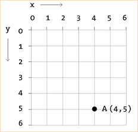
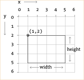
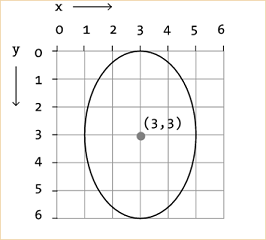
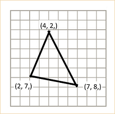
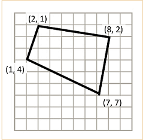
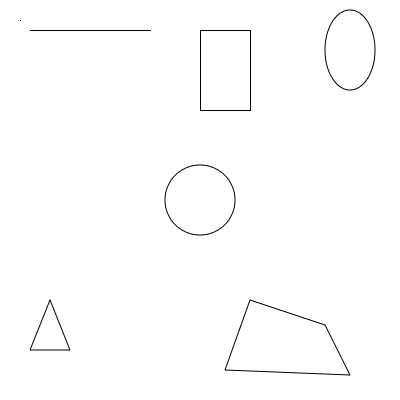

## Shapes

p5.js provides many pre-written functions for drawing common shapes. We can control how and where the shape is drawn by providing different data values to the function parameters.

### Points & Lines

**Points** are drawn as single dots given as two parameters to the `point` function: X, then Y
```javascript
// x = 4, y = 5
point(4, 5); 
```



**Lines** are drawn between two coordinates given as four parameters to the `line` function: Start X, Start Y, End X, End Y
```javascript
// Line between 0, 0 & 4, 5
line(0, 0, 4, 5); 
```

#### Practice
Using your graph paper, try to figure out what the following program will draw. 
- Assume that each square in the grid is 10 pixels wide and 10 pixels high.
- Start by drawing the outline of the canvas and figuring out the cooridinates of each corner (i.e. the top left is x=0, y=0).

```javascript
function setup() {
  createCanvas(200, 200);
}

function draw() {
  background("White");
  
  line(20,20,20,80);
  line(60,20,60,80);
  line(20,50,60,50);
  
  line(80,20,120,20);
  line(80,80,120,80);
  line(100,20,100,80);
  
  line(150,20,150,70);
  point(150,80);
}
```

[Answer](images/lines_answer.jpg)

### Rectangles
**Rectangles** are drawn with their top left corner at a given coordinate using a given width and height.

```javascript
// Rectangle starting at 1, 2
// with a width of 4 and height of 3
rect(1, 2, 4, 3);
```



### Ellipses
**Ellipses (ovals)** are drawn with their *center* at a given coordinate using a given width and height.

```javascript
// Ellipse centered at 3, 3
// with a width of 4 and height of 6
ellipse(3, 3, 4, 6);
```




### Triangles & Quads
**Triangles** and **Quads** are drawn as connections between the given coordinates. (3 coordinates for triangles, 4 for quads.)

```javascript
// Triangle with corners at: 
// - 4, 2
// - 7, 8
// - 2, 7
triangle(4, 2, 7, 8, 2, 7);
```



```javascript
// Quad with corners at: 
// - 2, 1
// - 8, 2
// - 7, 7
// - 1, 4
quad(2, 1, 8, 2, 7, 7, 1, 4);
```


## Example

```javascript
    // Top left - a point and a line
    point(20, 20);
    
    line(30, 30, 150, 30);
    
    // Top center - rectangle
    rect(200, 30, 50, 80);
    
    // Top right - ellipse
    ellipse(350, 50, 50, 80);
    
    // Center - circle via an ellipse with the same w and h
    ellipse(200,200,70,70);
    
    // Bottom left - triangle
    triangle(50, 300, 30, 350, 70, 350);
    
    // Bottom right - quad
    quad(250, 300, 325, 325, 350, 375, 225, 370);
    
```



