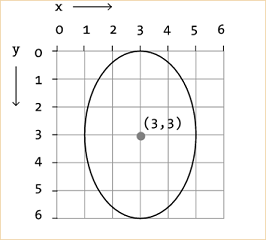
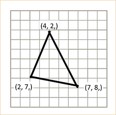
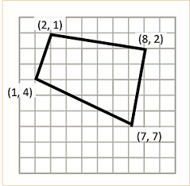
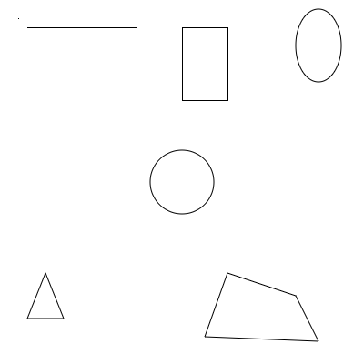

## Shapes

p5.js provides many pre-written functions for drawing common shapes. We can control how and where the shape is drawn by providing different data values to the function parameters.

### Points & Lines

**Points** are drawn as single dots on the canvas at the given coordinate.

```
// x = 4, y = 5
point(4, 5); 
```


**Lines** are drawn between two coordinates.

```
// Line between 20, 20 & 20, 100
line(20, 20, 20, 100); 
```

### Rectangles
**Rectangles** are drawn with their top left corner at a given coordinate using a given width and height.

```
// Rectangle starting at 1, 2
// with a width of 4 and height of 3
rect(1, 2, 4, 3);
```


### Ellipses
**Ellipses (ovals)** are drawn with their *center* at a given coordinate using a given width and height.

```
// Ellipse centered at 3, 3
// with a width of 4 and height of 6
ellipse(3, 3, 4, 6);
```




### Triangles & Quads
**Triangles** and **Quads** are drawn as connections between the given coordinates. (3 coordinates for triangles, 4 for quads.)

```
// Triangle with corners at: 
// - 4, 2
// - 7, 8
// - 2, 7
triangle(4, 2, 7, 8, 2, 7);
```



```
// Quad with corners at: 
// - 2, 1
// - 8, 2
// - 7, 7
// - 1, 4
quad(2, 1, 8, 2, 7, 7, 1, 4);
```


## Example

```
    // Top left - a point and a line
    point(20, 20);
    
    line(30, 30, 150, 30);
    
    // Top center - rectangle
    rect(200, 30, 50, 80);
    
    // Top right - ellipse
    ellipse(350, 50, 50, 80);
    
    // Center - circle via an ellipse with the same w and h
    ellipse(200,200,70,70);
    
    // Bottom left - triangle
    triangle(50, 300, 30, 350, 70, 350);
    
    // Bottom right - quad
    quad(250, 300, 325, 325, 350, 375, 225, 370);
    
```

