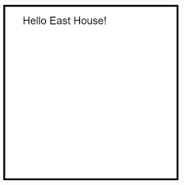

# Shapes & Colors
p5.js provides many pre-written functions for drawing common shapes & adding colors to them. 

We can make large letters using lines:


A smiley face is a set of circles and arcs:


p5.js has support for a lot of basic shapes that we can combine however/wherever we want!


## Putting it together
### **Copy ALL of the code from [the smiley demo](smileyDemoCode.md) and run it!**

## Things to try!
[ ] Change some colors
[ ] Make the face, eyes, and/or nose bigger
[ ] Add some freckles
[ ] Change the ORDER of some statements
    - What happens if the call to draw the face is last?!
[ ] Change the sizes/placement of the sample shapes at the bottom

## How does it work?

### Drawing
In order to draw something onto the canvas, we need to know:
- what we want to draw
- where we want to draw it

*What* is typically a shape of some sort (text, circles, lines, etc.).

*Where* is a **coordinate** on the canvas. We define these coordinates as a pair of offsets from the top left corner of the canvas: (x,y).
- **x**: The number of pixels right from the left side of the canvas.
- **y**: The number of pixels down from the top side of the canvas.

For example, in the 200x200 canvas defined above, the top left would be at x=0, y=0. The bottom right would be at x=200, y=200. We can represent this using a coordinate grid *(this is why your notebooks have graph paper)*.


We provide the coordinate where we want to *start* drawing to draw something at a specific location on the canvas.

To draw the text "Hello East House!" in the top left corner of the canvas (with a small offset right and down), we add statements to set the background to white and draw the text at the coordinates x=25, y=25.

```javascript
function draw() {
    background("White");
    text("Hello East House!", 25, 25);
}
```



### Shape functions & parameters
We control how and where each shape is drawn by providing different data values to the function parameters.


For example, the large "HI" in the image above, is drawn via a series of calls to the `line` command:
```javascript
  // The *line* method needs 4 parameters:
  //    - X for the starting point
  //    - Y for the starting point
  //    - X for the ending point
  //    - Y for the ending point
  line(20, 20, 20, 100);    // H left
  line(60, 20, 60, 100);    // H right
  line(20, 60, 60, 60);	    // H middle
  line(100, 20, 100, 100);  // I - draws a line from (100,20) to (100,100)
```

The smiley face itself is centered on the midpoint of the canvas: x = 200, y = 200. The nose & face are both drawn via circles, but with different widths.

```javascript
  // The *ellipse* method can be used to draw circles and ovals. 
  // Since we just need circles right now, we need 3 parameters:
  //   - The X & Y coordinates of the circle center
  //   - The width (diameter) of the circle
  ellipse(200,200,200);      // Face - draws a circle 200 pixels wide centered at (200, 200)
  ellipse(200,200,15);       // Nose - draws a circle 15 pixels wide centered at (200, 200) 
```

### Colors
Colors are added by calling `fill` with a color name before the statements for drawing specific shapes.

```javascript
  // Change the fill color to black before drawing the eyes
  fill("Black");
  ellipse(160,160,10);       // Left eye
  ellipse(240,160,10);       // Right eye
```
