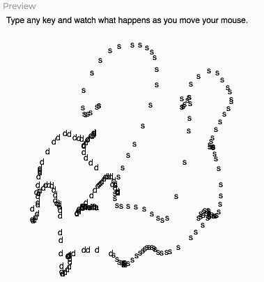
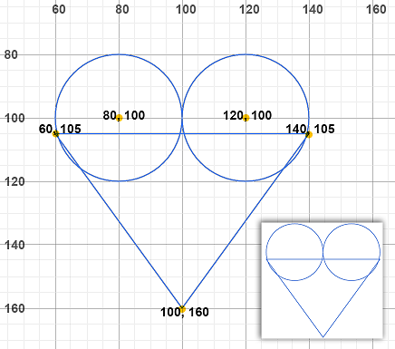
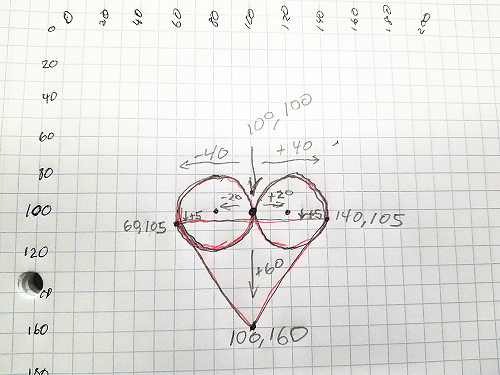
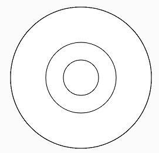

## Variables
A **variable** is a storage location in computer memory that contains a value. Variables can contain any type of value.
They are called "variables" because the value that they store can change - vary - and be updated.

### Global Variables Defined by p5.js
p5.js defines some variables for our use that store properties of the enviroment:
- `mouseX` (number): x-coordinate of the mouse
- `mouseY` (number): y-coordinate of the mouse
```javascript
     function draw() {
	    point(mouseX, mouseY);
     }
```
- `pmouseX` (number): x-coordinate of the mouse during the previous draw() cycle, i.e. previous *frame*
- `pmouseY` (number): y-coordinate of the mouse during the previous draw() cycle, i.e. previous *frame*
```javascript
     function draw() {
	     // Line from prior mouse position to current one
		 // ... a continuous scribbler
	     line(pmouseX, pmouseY, mouseX, mouseY);
     }
```
- `width` (number): width of the canvas
- `height` (number): height of the canvas
```javascript
	    // Circle in canvas center, exactly canvas size
	    ellipse(width / 2, height / 2, width, height);
```
- `frameCount` (number): Counts how many times draw() has run, i.e. how many *frames*
- `key` (string): The most recent keyboard key pressed by the user, e.g. "j", "p", "Shift", or "=".

Anywhere you need a number value, you could use a number-type variable or an expression with a number-type variable. Likewise for string values and variables.

### Example 1: Using variables in statements

```javascript
// Whatever key is typed is drawn
// at the mouse location

	function setup() {
		createCanvas(400, 400);
		text("Type any key and see what happens as you move your mouse:",
			  10, 10, width);
	}
	function draw() {
		// Don't cover over previous frames
		// background(220);

		// Let our typings follow the mouse!
		text(key, mouseX, mouseY);
	}
```


&nbsp;

### Example 2: Math expressions with variables
#### Stage 1: Draw a heart


```javascript
  // 2 scoops of ice cream
  ellipse(80, 100, 40, 40);
  ellipse(120, 100, 40, 40);
  // cone to hold them
  triangle(60, 105, 140, 105, 100, 160);

```


#### Stage 2: Draw a heart relative to position (100, 100)


```javascript
  // 2 scoops of ice cream
  ellipse(100 - 20, 100, 40, 40);
  ellipse(100 + 20, 100, 40, 40);
  // cone to hold them
  triangle(100 - 40, 100 + 5, 100 + 40, 100 + 5, 100, 100 + 60);
```


#### Stage 3: Draw a heart relative to the current mouse position
Everywhere we used 100 for x and y coordinates, use mouseX and mouseY instead.
```javascript
  // 2 scoops of ice cream
  ellipse(mouseX - 20, mouseY, 40, 40);
  ellipse(mouseX + 20, mouseY, 40, 40);
  // cone to hold them
  triangle(mouseX - 40, mouseY + 5, mouseX + 40, mouseY + 5, mouseX, mouseY + 60);
```


&nbsp;

### Practice 1:
Can you take a copy of a drawing (or part of one) that you've already done and use math expressions to make it move relative to mouse position?

&nbsp;

## Defining Our Own Variables
If there are values we want to be remembered for use later, and possibly change over time, we can define our own variables. This is usually done at the top of the program (above the setup() function block) or at the top of a function block.

Even better, we can assign any value we want to the variables we define. We often use variables to hold the results of a calculation we want to reuse.
```javascript
   // let name_of_variable = some_value_or_expression;
   let shapeScale = 16;
   let faveColor = "peru"; 
```
Once a variable has been defined with a **let** or a **var** statement, we can change its value with an **assignment statement**:
```javascript
   // name_of_variable = new_value_or_expression;
   faveColor = "turquoise";
```
&nbsp;&nbsp;&nbsp;&nbsp;&nbsp;&nbsp;
The action goes right to left across the **=** sign: the value `"turquoise"` replaces any current value in the variable `faveColor`.

### Example 3: 3 circles using a variable
```javascript
	// Initial variable definition
	let shapeScale = 16;

	// Size a circle based on variable
	ellipse(width / 2, height / 2, shapeScale * 15, shapeScale * 15);

	// Assign a new value to the variable
	// - half of the current scale
	shapeScale = shapeScale / 2;

	// Size a circle based on variable (this was pasted)
	ellipse(width / 2, height / 2, shapeScale * 15, shapeScale * 15);

	// Assign yet another value to the variable
	// - a fraction of the canvas height
	shapeScale = height * .01;

	// Size a circle based on variable (this was pasted)
	ellipse(width / 2, height / 2, shapeScale * 15, shapeScale * 15);
```


### Example 4: consistent shapes using variable
If you change the value of the variable in the following program, you change the size of all three shapes drawn.
```javascript
	// Global variable used to set size of shapes
	// changing this value changes size of shapes drawn
	let shapeSize = 140;

	function setup() {
	  createCanvas(400, 400);
	}

	function draw() {
	  background(220);
						  
	  // Each shape's size is determined by
	  // the value of the variable, shapeSize
	  rect(10, 10, shapeSize, shapeSize);
	  ellipse(width / 2, height / 2, shapeSize, shapeSize);
	  triangle(width, height,
			width - shapeSize, height,
			width - shapeSize, height - shapeSize);
	}
```


### Practice 2:
Let's edit the code in Example 4 to be interactive. 
We need to update the value of `shapeSize` based on the value of `mouseX`.
 - Make an empty line for our new code inside of the draw() function. Put it immediately after the line that sets the background color.
 - On our new empty line, type an **assignment statement** that sets the variable `shapeSize` equal to `mouseX`.
 
 When working properly, the size of the 3 shapes should grow and shrink together as you move your mouse across the canvas.

## References
- JavaScript variables: <a href="https://www.w3schools.com/js/js_variables.asp" target="_blank">https://www.w3schools.com/js/js_variables.asp</a>
- p5.js **ellipse** command: <a href="https://p5js.org/reference/#/p5/ellipse" target="_blank">https://p5js.org/reference/#/p5/ellipse</a>
- p5.js **rect** command: <a href="https://p5js.org/reference/#/p5/rect" target="_blank">https://p5js.org/reference/#/p5/rect</a>
- p5.js **triangle** command: <a href="https://p5js.org/reference/#/p5/triangle" target="_blank">https://p5js.org/reference/#/p5/triangle</a>
- Interactivity in p5.js: <a href="https://p5js.org/learn/interactivity.html" target="_blank">https://p5js.org/learn/interactivity.html</a>
